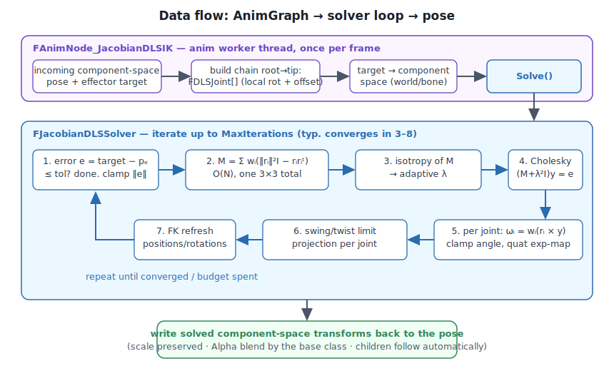

# JacobianDLSIK — Design & Implementation Notes

THEORY.md derives the math; this document explains how the code is shaped and
why. Section references like "§3.7" point into THEORY.md.

## 1. Architecture

Two layers, deliberately separated:

```
┌─ editor ────────────────────────┐      ┌─ runtime (anim worker thread) ─────────────────┐
│ UAnimGraphNode_JacobianDLSIK    │      │ FAnimNode_JacobianDLSIK                        │
│ (AnimGraph palette entry)       │─────▶│   pose I/O, bone spaces, LODs, debug           │
└─────────────────────────────────┘compiles      │  FDLSJoint[] + target   ▲ solved pose  │
                                      to  │      ▼                         │              │
                                          │ FJacobianDLSSolver — pure math,│no engine deps│
                                          │ beyond FVector/FQuat           │              │
                                          └────────────────────────────────────────────────┘
```

- **`FJacobianDLSSolver`** ([JacobianDLSSolver.h](JacobianDLSSolver.h)) knows
  nothing about skeletons, LODs, or anim graphs. It consumes an array of
  `FDLSJoint` (local offset + local rotation + weight/limits) and a target.
  This is what makes the math unit-testable headless
  ([Tests/JacobianDLSSolverTests.cpp](Tests/JacobianDLSSolverTests.cpp)) and
  reusable from a Control Rig unit or editor tool later.
- **`FAnimNode_JacobianDLSIK`** ([AnimNode_JacobianDLSIK.h](AnimNode_JacobianDLSIK.h))
  does everything engine-specific: chain extraction and validation, component
  space ↔ bone space conversions, ref-pose lookup for limits, scale
  preservation, debug draw, `GatherDebugData`.

## 2. The solve loop



Full pseudocode with section references: THEORY.md §4.

## 3. Decisions worth defending

**Why the `JJᵀ` form and never an explicit Jacobian matrix.** §3.7: the ball-joint
basis-axes parameterization collapses `J·W·Jᵀ` to a running 3×3 sum and `JᵀY` to
one cross product per joint. Storage O(1), work O(N), the only "linear algebra"
is a 3×3 Cholesky. A textbook implementation allocates a 3×3N matrix and
multiplies it — same asymptotics, several times the constant, plus allocation.

**Why Cholesky and not the adjugate/Cramer inverse.** `M + λ²I` is symmetric
positive definite by construction whenever λ > 0 (M is a sum of PSD terms), so
unpivoted Cholesky cannot fail, is ~35 flops, and is backward-stable. Cramer is
similar cost but loses accuracy exactly where we care (near-singular M).
The `FactorEpsilon` floor only exists for the pathological caller who sets
`Damping = 0` at an exact singularity.

**Why all deltas are computed against the pre-step parent rotation.** All
columns of J were measured at one linearization point. The linear model says the
effector moves by Σᵢ Jᵢωᵢ — a *sum* of independent contributions. Rebuilding
each local rotation against the *old* parent and then running FK composes
exactly those independent deltas down the chain. Applying deltas sequentially
against already-updated parents would double-apply parent motion and overshoot
(mildly, but systematically).

**Why the solver base is the chain root's *parent*.** So `FDLSJoint::LocalRotation`
is the true skeletal local rotation, which means `RefLocalRotation` can come
straight from the ref skeleton and swing/twist limits are anatomically
meaningful — including on the chain root itself.

**Why doubles in the accumulation.** M's entries are sums of |r|² terms — for a
2 m chain, magnitudes ~40000 with cancellation in the off-diagonals. UE5's LWC
already makes `FVector` doubles; keeping the factorization in doubles costs
nothing measurable and removes a whole class of near-singularity noise.

**Iteration limit as time-slicing.** The solver is stateless between frames, and
the incoming pose each frame is last frame's *animated* pose, not the solved
one — but targets move continuously, so 3–8 iterations/frame track moving
targets fine. `MaxIterations` is a budget knob, not a correctness knob.

## 4. Threading & memory

- `EvaluateSkeletalControl_AnyThread` runs on anim worker threads: the solver
  uses no statics, no globals, no allocation. `ScratchJoints` is per-node-instance
  and reused (`SetNum` grows once, then stable).
- `LastDebugInfo` is written on the worker and read by `GatherDebugData` (game
  thread). It's plain doubles/ints used only for on-screen debug text; a torn
  read shows a stale number for one frame. Deliberate non-synchronization.
- Chain indices are cached in `InitializeBoneReferences` (called on LOD change),
  not rebuilt per evaluate.

## 5. Performance profile

Per iteration: ~40 flops/joint for M + r, one 3×3 Cholesky (~35 flops), one
cross + quat exp + two quat muls per joint. Ballpark on a single modern core:
**single-digit microseconds for a 4-joint arm at 8 iterations**; the perf test
(30 joints × 12 iterations × 1000 solves) logs the measured per-solve cost so
regressions are visible. Compare against engine nodes with
`stat anim` / Unreal Insights on the same chain (method in TESTING.md §4).

## 6. Edge cases & known limitations

| case | behavior |
|---|---|
| target unreachable | extends toward target, settles at workspace boundary (clamped error, §3.10); tested |
| chain starts exactly singular (perfectly straight, target on-axis) | the singular direction's response is exactly zero (r × y annihilates it); adaptive damping + any transverse pose noise walks it out over a few iterations. Character poses are never exactly singular in practice |
| all weights 0 / chain < 2 bones | no-op, node validates |
| non-uniform / non-unit bone scale on chain | positions come from scaled relative transforms but FK recomposes without scale — assume uniform scale 1 on the chain (true for characters; documented, not asserted) |
| hard joint limits + far target | projection can park in a local minimum (limit surfing). Standard trade for hard limits; loosen limits or raise iterations |
| effector rotation | tip bone rotation is intentionally untouched (its position columns are zero anyway, §3.2); orient the tip after the node, or see extensions below (§7 of this file) |
| stretchy IK | not supported — rotations only, bone lengths inviolate |

## 7. Extensions (researched, not implemented)

- **6-DOF effector (position + orientation).** Stack angular rows: joint i's
  angular columns are just the axes themselves, so the angular block of JJᵀ is
  Σwᵢ·I and the coupling block is Σwᵢ[rᵢ]ₓ. `M` becomes 6×6 (still closed-form,
  still O(N)), Cholesky 6×6, ωᵢ = wᵢ(rᵢ × y_lin + y_ang). Roughly 2.5× the cost.
- **Multi-effector (two hands on one spine).** Block-stack per-effector systems:
  M becomes 3k×3k for k effectors with cross-effector coupling blocks
  Σ over *shared* joints. Worth it at k ≤ 3; beyond that PBIK's problem domain.
- **Selectively Damped Least Squares (Buss & Kim 2005).** Per-direction λ from
  the actual σ of each task direction — needs the 3×3 eigendecomposition
  (closed form exists). Better convergence at partial singularities; ~1.5× cost.
- **Nullspace posture bias.** For redundant chains, add
  `(I − J⁺J)·z` — a secondary "pull toward rest pose" objective that never
  disturbs the primary target. The natural cure for §6's local minima and for
  pose drift on long chains.
- **Soft limits.** Replace projection with a penalty term inside the objective
  (augments M's diagonal per-joint) — no local minima, but limits become
  suggestions. Hybrid (soft inside, hard projection at the boundary) is the
  robotics standard.
