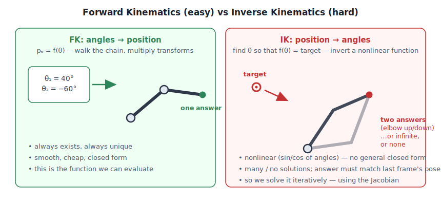

# Jacobian Damped Least Squares IK — Theory from First Principles

This document follows our research pipeline: **Concept → Understand → Code → Validate**.

| section | pipeline stage | what you get |
|---|---|---|
| 1. Concept Overview | Concept | the problem, why existing UE IK fails, what DLS promises |
| 2. Data Flow | Concept | the whole system as one diagram |
| 3. Algorithm | Understand | the math, derived step by step |
| 4. Pseudocode | Understand | the solve loop, language-free |
| 5. C++ Code | Code | where each equation lives in the source |
| 6. Review | Validate | trace one iteration by hand, with real numbers |

Notation used throughout (plain Unicode, no LaTeX):
`θ` joint angles · `Δθ` joint step · `pₑ` effector position · `t` target ·
`e` error vector · `J` Jacobian · `Jᵀ` transpose · `λ` damping · `σ` singular value ·
`rᵢ` lever arm of joint i · `×` cross product · `‖v‖` length · `Σ` sum · `I` identity matrix.

---

## 1. Concept Overview

### 1.1 FK is easy, IK is the reverse — and the reverse is hard

**Forward kinematics (FK)**: given all joint rotations θ, compute where the hand ends up.

```
pₑ = f(θ)        (walk the chain, multiply transforms — one answer, always)
```

**Inverse kinematics (IK)**: given where the hand *should* be, find the joint rotations.

```
find θ  such that  f(θ) = t
```



IK is hard for structural reasons, not implementation reasons:

- **Nonlinear** — f is built from sines/cosines of angles; no closed form for chains longer than 2 bones.
- **Many answers** — a 7-DOF arm reaching a 3-DOF position target has an infinite *family* of valid poses (the elbow can orbit). Which one do we pick?
- **No answer** — the target may be out of reach.
- **Temporal coherence** — frame N's answer must be near frame N−1's answer, or the character pops.

Two-bone chains have an exact closed form (law of cosines — that is literally UE's Two Bone IK node). Everything longer is solved **iteratively**: start at the current pose, take steps that shrink the error, stop when close. The whole game is: *what is a good step?* The Jacobian answers that.

### 1.2 What's wrong with the IK Unreal already ships

| Solver | Method | Breaks down when… |
|---|---|---|
| **Two Bone IK** | analytic | …the chain has more than 2 bones. Ever. |
| **CCD** (`AnimNode_CCDIK`) | rotate one joint at a time, greedily | chain *curls tip-heavy* (last-serviced joints grab all the error), poses depend on sweep order, oscillates near the target |
| **FABRIK** (`AnimNode_Fabrik`) | slide joint *positions*, derive rotations after | **twist is undefined** (forearm roll drifts), joint limits are reprojection hacks, stiffness is not principled |
| **Full Body IK** (FBIK) | position-based dynamics | great for full-body multi-effector; heavy and empirically-tuned for a single chain |

And **all** undamped iterative methods share one deeper flaw — the singularity problem:


When a limb approaches full extension (planted straight leg, full-reach grab — everyday gameplay poses), the math of a plain Jacobian/pseudoinverse solver demands joint steps proportional to **1/σ**, where σ → 0 at extension. Result on screen: knee jitter, elbow pops, pose flips. Section 3.5 shows exactly why.

### 1.3 What DLS promises

**Damped Least Squares** changes the question. Instead of "reach the target at any cost", it asks:

> minimize   (task error)² + λ² · (joint motion)²

That one added term caps the solver's response at **1/(2λ) — bounded everywhere, by construction**. No pose, no target, no frame can produce an exploding joint step. Near-singular poses trade a little accuracy for stability — the leg *eases* into full extension instead of snapping. Far from singularities, DLS behaves identically to the ideal least-squares solution.

On top of that, this implementation adds:
- **O(N) cost with a single 3×3 solve per iteration** (the math trick in §3.7) — no big matrices, ever;
- **per-joint weights** with exact meaning (§3.8) — "spine 20%, neck 60%, head 100%";
- **swing/twist joint limits** as hard constraints (§3.9);
- **adaptive damping** that pays the stability tax only near singular poses (§3.10).

---

## 2. Data Flow

One frame, end to end:


Split of responsibilities (why there are two layers):

```
┌───────────────────────────────────────────────────────────────────┐
│ FAnimNode_JacobianDLSIK        (engine-facing, anim worker thread)│
│   knows: skeletons, bone spaces, LODs, ref pose, debug draw      │
│   does : pose → FDLSJoint[] → Solve() → pose                     │
├───────────────────────────────────────────────────────────────────┤
│ FJacobianDLSSolver             (pure math, engine-agnostic)      │
│   knows: FVector/FQuat only — no skeleton, no UObject            │
│   does : the loop in the diagram above                           │
└───────────────────────────────────────────────────────────────────┘
```

The solver being pure math is what makes it unit-testable headless
([Tests/JacobianDLSSolverTests.cpp](Tests/JacobianDLSSolverTests.cpp)) and reusable
from a Control Rig unit or an editor tool later.

---

## 3. Algorithm

### 3.1 Linearization — the one idea underneath all Jacobian IK

f is nonlinear, but every smooth function looks **linear up close** (first-order Taylor expansion):

```
f(θ + Δθ)  ≈  f(θ) + J(θ)·Δθ
```

`J` is the **Jacobian**: the matrix of all first partial derivatives ∂pₑ/∂θ.
It has 3 rows (x, y, z of the effector) and one column per joint DOF.

Read it **column by column** — this is the intuition that matters:

> **Column j of J = the instantaneous velocity of the end effector
> if you rotate only joint j, at unit speed.**

The Jacobian answers: *"if I wiggle each joint a little, which way does the hand move?"*
With it, each IK iteration is just:

```
1.  e = t − pₑ                measure the error
2.  solve J·Δθ = e            find a joint step (the LINEAR problem)
3.  apply Δθ, redo FK          repeat until ‖e‖ small
```

This is Newton's method for root finding, applied to f(θ) − t = 0. Everything
that follows — pseudoinverse, damping, singularities — is about making step 2 behave.

### 3.2 The geometric Jacobian — deriving the columns

We never differentiate f symbolically. For rotating joints the columns have a closed geometric form.

**The rigid-body fact.** A body rotating with angular velocity ω about a point p moves any
attached point x with linear velocity:

```
v = ω × (x − p)
```

(velocity is perpendicular to both the axis and the lever arm; grows with distance from the axis).

**The consequence.** If joint i sits at position pᵢ and rotates about unit axis a at unit
speed, everything downstream — including the effector — rotates rigidly around it. So:

```
∂pₑ/∂θᵢ  =  a × (pₑ − pᵢ)  =  a × rᵢ          where  rᵢ = pₑ − pᵢ  (the lever arm)
```


Two properties you can *see* in the picture and should internalize:

- **Long lever arms dominate.** ‖a × r‖ ≤ ‖r‖: the shoulder (far from the hand) gets big
  columns, the wrist tiny ones. Least-squares solutions therefore naturally favor
  root-side joints — usually desirable, and tunable with weights (§3.8).
- **The tip bone's own columns are zero** (r = 0): rotating the hand can't move the
  hand's origin. The solver skips it automatically, preserving animated hand orientation.

**Ball joints.** Animation bones are 3-DOF ball joints, not single-axis hinges. We model
each as three revolute DOF about the fixed component-space axes eₓ, e_y, e_z → 3 columns
per joint, J is 3 × 3N. This choice looks arbitrary until §3.7, where it makes the whole
system collapse to 3×3.

### 3.3 Solving J·Δθ = e — least squares and the pseudoinverse

J is 3 × 3N — wide, not square, so `J⁻¹` does not exist. With more DOF than constraints
the system is **underdetermined**: infinitely many Δθ move the hand the same way. We need
a selection rule.

The classical rule is the **Moore–Penrose pseudoinverse** `J⁺`, which returns the
*minimum-norm* solution — the smallest total joint motion that achieves the task:

```
Δθ = J⁺·e = Jᵀ·(J·Jᵀ)⁻¹·e
```

- Target achievable → among all joint steps that achieve it, take the one that disturbs
  the pose least. Exactly what animation wants.
- Target not achievable → take the step minimizing ‖J·Δθ − e‖. Best effort.

Note the shape trick already at work: `J·Jᵀ` is only **3×3** no matter how many joints —
we invert in *task space* (3D), never in joint space (3N-D).

This works beautifully… until the arm straightens.

### 3.4 The SVD lens — seeing what a matrix really does

Any matrix factors as `J = U·Σ·Vᵀ` (singular value decomposition): rotate joint space (V),
scale by the **singular values** σ₁ ≥ σ₂ ≥ σ₃ ≥ 0, rotate task space (U). Physically:

> The columns of U are the principal directions the effector can move;
> each σ says *how easily* it moves that way (cm of hand motion per radian of joint motion).

Push the pseudoinverse through the SVD and the danger becomes visible:

```
Δθ = Σₖ  (1/σₖ) · vₖ · (uₖ·e)
         ↑
         the gain applied to error along direction uₖ
```

**As σₖ → 0 the gain 1/σₖ → ∞.** There's the bomb, in plain sight.

### 3.5 Singularities — what they are and why "near" is worse than "at"

A **singular configuration** is a pose where some task direction has σ = 0 — the mechanism
*cannot* move the effector that way, no matter what the joints do. The everyday cases:

- **Fully extended limb** (boundary singularity): arm straight, target further out. Every
  column a × rᵢ is perpendicular to the arm axis, so motion *along* the arm is impossible.
  This is the planted straight leg and the full-reach grab — constant gameplay poses.
- **Aligned axes** (internal singularity): two joints' effective axes line up, their
  columns become linearly dependent — a DOF silently lost.

**Exactly at** σ = 0, a careful implementation just drops that direction (defines 1/σ = 0).
The disaster is the **neighborhood**: σ = 0.01 means gain 100 — a 10 cm error component
demands ~1000 radians of joint motion in one step. On screen:

- **jitter** as the leg approaches straight — tiny target noise × huge gain,
- **snapping/flipping** — the knee pops to the other solution branch,
- error that *grows* between iterations, because a 1000-radian step lands somewhere the
  linear model never promised anything about.

This is not a numerical bug you can epsilon away. The math is doing exactly what was asked:
*"reach the unreachable direction at any cost."* The fix is to change the question.

### 3.6 Damped Least Squares — the fix, derived

DLS (also called Levenberg–Marquardt; brought to IK by Wampler 1986 and
Nakamura & Hanafusa 1986) changes the objective to:

```
minimize   ‖J·Δθ − e‖²  +  λ²·‖Δθ‖²
           └─ task error ─┘   └─ joint motion cost ─┘
```

λ is the **damping factor** — the exchange rate between task accuracy and joint effort.
(This is Tikhonov regularization, the standard cure for ill-conditioned inverse problems.)

**Derivation.** The objective is a quadratic bowl in Δθ. Set its gradient to zero:

```
2·Jᵀ·(J·Δθ − e) + 2·λ²·Δθ = 0
⇒  (JᵀJ + λ²I)·Δθ = Jᵀ·e            ← the "normal equations",  (3N×3N system)
```

The matrix `JᵀJ + λ²I` is positive definite for λ > 0, so this is the unique global
minimum — DLS has exactly one answer, always. Now the identity that makes it cheap.
Since `Jᵀ·(JJᵀ + λ²I) = (JᵀJ + λ²I)·Jᵀ` (multiply out both sides — one line), we can
swap which side gets inverted:

```
┌─────────────────────────────────────┐
│   Δθ = Jᵀ · (J·Jᵀ + λ²I)⁻¹ · e     │      ← THE equation this solver implements
└─────────────────────────────────────┘
```

Same answer, but the matrix inverted is **3×3** (task space), not 3N×3N (joint space).

**What damping does, per direction.** Substituting the SVD gives the per-direction gain:

| | pseudoinverse | DLS |
|---|---|---|
| gain along direction with singular value σ | `1/σ` | `σ/(σ² + λ²)` |
| σ ≫ λ (healthy pose) | 1/σ | ≈ 1/σ — **identical**, damping invisible |
| σ = λ | 1/λ | 1/(2λ) — the **maximum possible gain** |
| σ → 0 (singular) | → ∞ 💥 | → σ/λ² → 0 — smoothly *gives up* on impossible directions |


The gain is bounded by **1/(2λ) everywhere**. That single bound is the whole value
proposition: jitter and snapping become impossible *by construction*, not by clamps and
hacks. The price is honest and visible: near singular poses the solver eases toward the
target instead of hitting it exactly — which is precisely how a natural limb behaves.

**Units and tuning.** J's entries are cm/rad and σ scales with lever-arm length, so λ
shares those units. Tune relative to chain size: **1–5% of chain length**
(60 cm arm → λ ≈ 1–3). Too small = lively near singularities; too big = syrupy everywhere.

### 3.7 The O(N) trick — DLS with one 3×3 solve, no Jacobian matrix at all

This is what makes this implementation faster than a textbook one. Two identities
eliminate the explicit Jacobian entirely.

**Identity 1 — J·Jᵀ has a closed form.** With ball joints as 3 DOF about the basis axes
(§3.2), joint i contributes columns eₓ×rᵢ, e_y×rᵢ, e_z×rᵢ. Sum the outer products of
those three columns and something beautiful happens:

```
(eₓ×r)(eₓ×r)ᵀ + (e_y×r)(e_y×r)ᵀ + (e_z×r)(e_z×r)ᵀ  =  ‖r‖²·I − r·rᵀ
```

(Verify once by hand: write a×r = −[r]ₓ·a with the skew matrix [r]ₓ, use
Σ a·aᵀ = I over any orthonormal basis, and [r]ₓ·[r]ₓᵀ = ‖r‖²I − rrᵀ. Three lines.)

So the entire 3×3N Jacobian collapses to a running 3×3 sum:

```
┌──────────────────────────────────────────────┐
│   M  =  J·Jᵀ  =  Σᵢ ( ‖rᵢ‖²·I − rᵢ·rᵢᵀ )    │      one 3×3 accumulation per joint
└──────────────────────────────────────────────┘
```

Physics aside: `‖r‖²I − rrᵀ` is exactly the inertia tensor of a unit point mass at r.
M is the "inertia" of the effector as seen through the joints — singular pose ⇔ all
lever arms collinear ⇔ degenerate inertia. This intuition powers §3.10's singularity detector.

**Identity 2 — Jᵀ·y is a cross product.** After solving the 3×3 system
`(M + λ²I)·y = e`, joint i's three components of Δθ = Jᵀy are `(a×rᵢ)·y` for the three
axes. By the scalar triple product `(a×r)·y = a·(r×y)`, those three numbers are simply
the components of **one vector**:

```
┌──────────────────────┐
│   ωᵢ = rᵢ × y        │      the rotation vector for joint i
└──────────────────────┘        axis = direction of ωᵢ, angle = ‖ωᵢ‖ (radians)
```

Apply it as a quaternion via the exponential map (`FQuat(axis, angle)`). That's the whole
per-joint update: **one cross product**.

Cost per iteration: ~40 flops per joint for M, one 3×3 Cholesky (~35 flops), one cross +
quat composition per joint. **O(N), zero allocations, no matrix storage.** A textbook DLS
builds the 3×3N Jacobian and multiplies it out — same asymptotics, several times the
constant, plus cache traffic.

### 3.8 Per-joint weighting — stiffness with exact semantics

"Use the shoulder more than the wrist. Barely involve the spine." Scaling joint updates
*after* solving breaks convergence (the solve assumed motion the joints then refuse to do).
The correct way charges different joints different prices *inside* the objective, which
works out to a weighted DLS with per-DOF weight matrix W:

```
Δθ = W·Jᵀ·(J·W·Jᵀ + λ²I)⁻¹·e
```

Implementation cost: nearly free — the weight wᵢ multiplies joint i's term in both places:

```
M  = Σᵢ wᵢ·(‖rᵢ‖²I − rᵢrᵢᵀ)          ωᵢ = wᵢ·(rᵢ × y)
```

`w = 0` locks a joint exactly. `w = 0.2` makes it 5× more expensive than a free joint, and
the least-squares trade-off *plans around it* instead of being surprised by it. Compare
FABRIK, where stiffness is a position-lerp hack applied after the fact.

### 3.9 Joint limits — swing/twist projection

After each step, each local rotation is decomposed **relative to the reference pose** as
`Rel = Swing · Twist` (UE: `FQuat::ToSwingTwist`), where Twist is the roll around the
bone's own length axis and Swing is the tilt of that axis. Clamp each separately
(cone for swing, min/max angle for twist), recompose.

This is projected gradient descent, Gauss–Seidel flavored: later iterations re-solve
*around* a clamped joint, routing the remaining error through the free ones. Hard limits
can create local minima on extreme targets (documented in DESIGN.md §6) — the standard
trade against soft-penalty limits, which never actually guarantee the constraint.

### 3.10 Adaptive damping + two safeguards

**Adaptive damping (Nakamura & Hanafusa).** Fixed λ is a compromise: big enough for the
worst singular pose = sluggish in every normal pose. Better: *measure* how close to
singular the pose is and ramp damping only there. Classical manipulability
`w = √det(JJᵀ)` has units cm³ (thresholds don't transfer between chains), so we use a
dimensionless version — for M's eigenvalues the AM–GM inequality gives:

```
isotropy = det(M) / (trace(M)/3)³   ∈ [0, 1]
           1 → effector moves equally well in all directions
           0 → singular (some σ = 0)

λ = λ_base + λ_extra · (1 − isotropy/τ)²      when isotropy < τ  (default τ = 0.1)
```

det and trace of a matrix we already built: the detector is ~10 flops. The quadratic
ramp keeps λ's derivative continuous at the threshold — no visible "damping kicked in" pop.

**Safeguard 1 — clamped error (Buss & Kim).** The linear model is only honest near the
current pose. If the target is 3 m away, don't feed a 300 cm error into a local
linearization — clamp ‖e‖ to `MaxErrorStep` (≈ half chain length) and walk there over a
few iterations. Also fixes the classic unreachable-target oscillation: the chain extends
smoothly and settles at the workspace boundary.

**Safeguard 2 — per-joint angle clamp.** Hard cap (default 10°/iteration) on each ‖ωᵢ‖.
With sane damping it never engages; it exists so no tuning mistake can ever emit a broken
pose to the renderer. Defense in depth, not a correctness mechanism.

---

## 4. Pseudocode

```
SOLVE(joints[0..N-1], base, target, settings):
    FK(joints, base)                                # component-space positions

    repeat up to MaxIterations:
        e = target − joints[N-1].position           # effector = tip joint origin
        if ‖e‖ ≤ tolerance: stop                    # converged
        if ‖e‖ > MaxErrorStep: e *= MaxErrorStep/‖e‖    # §3.10 clamped error

        # -- build the 3×3 system (§3.6, §3.8) --
        M = 0
        for i in 0 .. N-2:                          # tip skipped: r = 0
            r = effector − joints[i].position
            M += wᵢ · (‖r‖²·I − r·rᵀ)

        # -- adaptive damping (§3.10) --
        iso = det(M) / (trace(M)/3)³
        λ = λ_base + λ_extra·(1 − iso/τ)²  if iso < τ else λ_base

        # -- the DLS solve (§3.6) --
        y = cholesky_solve_3x3(M + λ²·I, e)

        # -- apply per-joint updates (§3.6, §3.9) --
        for i in 0 .. N-2:
            ωᵢ = wᵢ · ((effector − joints[i].position) × y)
            clamp ‖ωᵢ‖ to MaxAngleStep
            ΔQ = quat_exp(ωᵢ)                       # axis-angle → quaternion
            # rebuild local rotation against the PRE-step parent:
            # all deltas share one linearization point (DESIGN.md §3)
            joints[i].localRot = inverse(oldParentRot) · ΔQ · oldComponentRot
            if limited: clamp_swing_twist(joints[i])

        FK(joints, base)                            # compose deltas down the chain
```

---

## 5. C++ Code — where each equation lives

| equation / concept | file : function |
|---|---|
| FK composition | [JacobianDLSSolver.cpp](JacobianDLSSolver.cpp) : `ForwardKinematics` |
| `M = Σ wᵢ(‖rᵢ‖²I − rᵢrᵢᵀ)` | `Solve`, the accumulation loop |
| isotropy + adaptive λ | `Solve`, the damping block |
| `(M + λ²I)·y = e` | `SolveDamped3x3` (3×3 Cholesky — SPD by construction, cannot fail for λ > 0) |
| `ωᵢ = wᵢ(rᵢ × y)` + exp map | `Solve`, the apply loop |
| swing/twist limits | `ClampSwingTwist` |
| pose ↔ solver conversion, spaces, LODs | [AnimNode_JacobianDLSIK.cpp](AnimNode_JacobianDLSIK.cpp) : `EvaluateSkeletalControl_AnyThread` |
| chain building/validation | same file : `InitializeBoneReferences` |
| AnimGraph palette node | [AnimGraphNode_JacobianDLSIK.cpp](AnimGraphNode_JacobianDLSIK.cpp) |

Reading order for the code: `ForwardKinematics` → `Solve` top to bottom with §4 beside it
→ `SolveDamped3x3` → `ClampSwingTwist` → then the anim node's evaluate.

---

## 6. Review — trace one iteration by hand

Validate the math with a 2-joint arm you can draw on paper. Bone length 30 cm,
second bone bent 90° up, all weights 1, λ = 1:

```
joint0 at p₀ = (0, 0, 0)
joint1 at p₁ = (30, 0, 0)
effector pₑ = (30, 30, 0)          (tip joint origin)
target   t  = (45, 15, 0)

                y
                ↑    pₑ(30,30)
                │     ●
                │     ┃ bone2        × t(45,15)
                │     ┃
                ●━━━━━●───────→ x
              p₀      p₁(30,0)
```

**Step 1 — error:**  `e = t − pₑ = (15, −15, 0)`, ‖e‖ ≈ 21.2 cm (no clamp needed).

**Step 2 — lever arms:**

```
r₀ = pₑ − p₀ = (30, 30, 0)      ‖r₀‖² = 1800
r₁ = pₑ − p₁ = (0, 30, 0)       ‖r₁‖² =  900
```

**Step 3 — build M** (each term is ‖r‖²I − rrᵀ):

```
joint0 term:  ⎡ 1800−900   −900      0 ⎤   ⎡  900  −900     0 ⎤
              ⎢  −900    1800−900    0 ⎥ = ⎢ −900   900     0 ⎥
              ⎣    0        0     1800 ⎦   ⎣    0     0  1800 ⎦

joint1 term:  ⎡ 900   0    0 ⎤      note the 0 in the (y,y) slot: ‖r₁‖² − r₁ᵧ² = 900−900.
              ⎢   0   0    0 ⎥      r₁ points straight up, so rotating joint1 moves the
              ⎣   0   0  900 ⎦      effector only sideways — zero mobility along y. ✓

M = ⎡ 1800  −900     0 ⎤
    ⎢ −900   900     0 ⎥
    ⎣    0     0  2700 ⎦
```

Sanity read of M itself: the (y,y) entry 900 < the (x,x) entry 1800 — the arm moves the
effector in x more easily than in y from this pose. The matrix *knows* the mechanism.

**Step 4 — isotropy:** det(M) = (1800·900 − 900²)·2700 = 810000·2700 ≈ 2.19e9;
(trace/3)³ = (5400/3)³ = 1800³ ≈ 5.83e9 → isotropy ≈ **0.375**. Above τ = 0.1 →
healthy pose, no extra damping. λ = 1, λ² = 1.

**Step 5 — solve (M + I)·y = e.** z stays 0 (no z error); the 2×2 block:

```
⎡ 1801  −900 ⎤ ⎡y_x⎤   ⎡ 15⎤          y_x ≈  0.0000185
⎣ −900   901 ⎦ ⎣y_y⎦ = ⎣−15⎦    ⇒     y_y ≈ −0.0166
```

(Check row 2: −900·0.0000185 + 901·(−0.0166) ≈ −15 ✓)

**Step 6 — per-joint rotation vectors** ωᵢ = rᵢ × y:

```
ω₀ = (30,30,0) × (0.0000185, −0.0166, 0) = (0, 0, −0.499)   ≈ −28.6° about z
ω₁ = ( 0,30,0) × (0.0000185, −0.0166, 0) = (0, 0, −0.00055) ≈ −0.03° about z
```

Read what the solver decided: rotate the *shoulder* clockwise by ~28.6° and barely touch
the elbow — the shoulder's lever arm is longer, so least-squares routes the motion there
(§3.2 "long lever arms dominate"). The 10° `MaxAngleStep` clamp would actually cap ω₀ this
iteration and let convergence take ~3 iterations — by design.

**Step 7 — verify against the linear model.** The model predicts the effector moves by
Σ ωᵢ × rᵢ:

```
ω₀ × r₀ = (0,0,−0.499) × (30,30,0) = (14.98, −14.98, 0)
ω₁ × r₁ = (0,0,−0.00055) × (0,30,0) = ( 0.017,   0,    0)
predicted move ≈ (15.0, −15.0, 0) = e   ✓
```

The linear model says we land exactly on the target; the true rotation (nonlinear) will
land *close*, and iteration 2 cleans up the residue. That gap between the linear
prediction and the curved reality is precisely why IK iterates — and why the error clamp
of §3.10 exists.

**Automated version of this review:** every claim above is enforced by a test —
`FiniteDifferenceJacobian` (step 6's columns match numerical FK probing),
`ReachableTargetConverges` (the iteration finishes the job),
`DampingBoundsSingularStep` (§3.5/3.6's boundedness). Map in [TESTING.md](TESTING.md).

---

## References

- S. Buss — *Introduction to Inverse Kinematics with Jacobian Transpose, Pseudoinverse
  and Damped Least Squares Methods* (2004). The canonical tutorial; this module is
  closest to its DLS-with-clamping recommendation.
- C. Wampler — *Manipulator Inverse Kinematic Solutions Based on Vector Formulations and
  Damped Least-Squares Methods*, IEEE SMC (1986).
- Y. Nakamura, H. Hanafusa — *Inverse Kinematic Solutions With Singularity Robustness for
  Robot Manipulator Control*, ASME JDSMC (1986). Adaptive damping.
- S. Buss, J.-S. Kim — *Selectively Damped Least Squares for Inverse Kinematics*, JGT
  (2005). Per-direction damping — the natural next step (DESIGN.md §7).
- A. Aristidou, J. Lasenby et al. — *Inverse Kinematics Techniques in Computer Graphics:
  A Survey*, CGF (2018). The field map, written by FABRIK's authors and fair to all sides.
