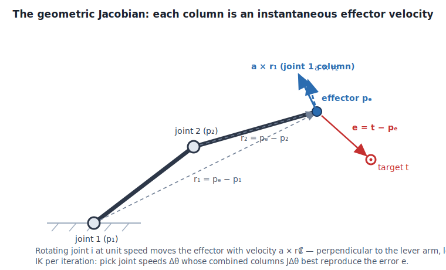
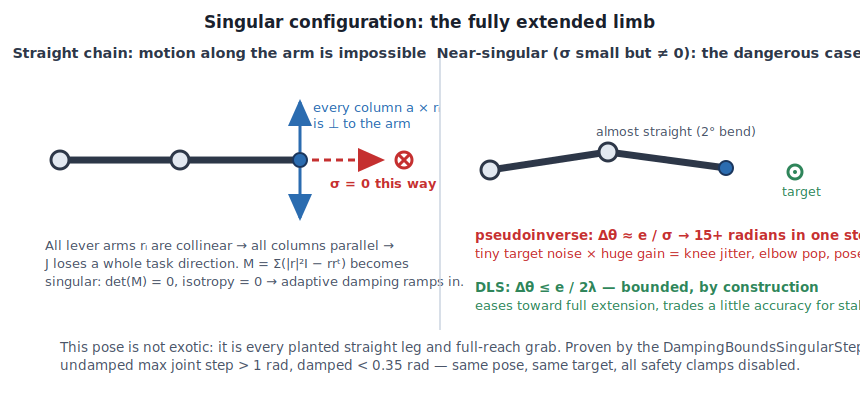
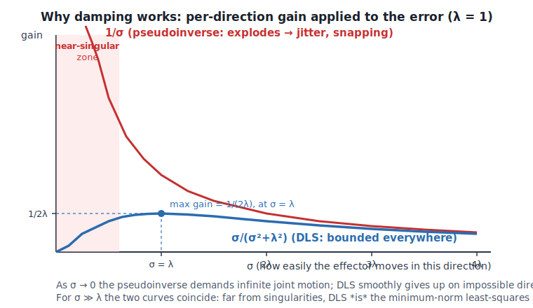

# Jacobian Damped Least Squares IK — Theory from First Principles

This is the math behind [JacobianDLSSolver.cpp](JacobianDLSSolver.cpp), derived
step by step. Nothing here is hand-waved: every equation the code uses is proven
in this document, and every design choice traces back to one of these sections.
Read it top to bottom once; afterwards each section stands alone as a reference.

Notation: bold lowercase = vector, uppercase = matrix, $\theta$ = joint
parameters, $\mathbf{e}$ = error, $N$ = joint count, cm/radians throughout.

---

## 1. The problem: IK is FK run backwards, and that's the hard direction

**Forward kinematics (FK)** is a function: given all joint rotations
$\theta = (\theta_1, \ldots, \theta_n)$, it produces the end effector position

$$\mathbf{p}_e = f(\theta)$$

FK is trivial — walk the chain, multiply transforms. It is smooth, cheap, and
has exactly one answer.

**Inverse kinematics (IK)** asks the reverse: given a desired target
$\mathbf{t}$, find $\theta$ such that $f(\theta) = \mathbf{t}$. This is hard for
structural reasons, not implementation reasons:

- $f$ is **nonlinear** (built from sines/cosines of joint angles) — no closed
  form for general chains.
- Solutions are **not unique**: a 7-DOF arm reaching a 3-DOF position target has
  a 4-dimensional *family* of valid poses (elbow can orbit). Which one do we want?
- Solutions may **not exist**: target outside reach.
- Solutions must be **temporally coherent**: frame N's answer must be near frame
  N−1's answer, or the character pops.

Only 2-bone chains have a nice closed form (law of cosines — that's exactly what
UE's Two Bone IK node is). For everything longer, we solve iteratively: start at
the current pose, take steps that reduce the error, stop when close enough. The
question becomes: *what is a good step?* — and that's where the Jacobian enters.

---

## 2. Linearization: the one idea underneath all Jacobian IK

$f$ is nonlinear, but *any* smooth function looks linear if you zoom in far
enough (first-order Taylor expansion):

$$f(\theta + \Delta\theta) \approx f(\theta) + J(\theta)\,\Delta\theta$$

$J$ is the **Jacobian matrix**: the matrix of all first partial derivatives,

$$J = \frac{\partial \mathbf{p}_e}{\partial \theta} \in \mathbb{R}^{3 \times n},
\qquad J_{ij} = \frac{\partial (p_e)_i}{\partial \theta_j}$$

Read it column by column — that's the intuition that matters:

> **Column $j$ of $J$ = the instantaneous velocity of the end effector if you
> rotate only joint $j$ at unit speed.**

The Jacobian answers: "if I wiggle each joint a little, which way does the hand
move?" IK per iteration is then just:

1. Measure the error $\mathbf{e} = \mathbf{t} - \mathbf{p}_e$ (where we want to
   go, from where we are).
2. Solve the *linear* system $J\,\Delta\theta = \mathbf{e}$ for a joint step.
3. Apply $\Delta\theta$, recompute FK, repeat.

This is Newton's method for root finding, applied to $f(\theta) - \mathbf{t} = 0$.
Everything else in this document — pseudoinverse, damping, singularities — is
about making step 2 behave.



---

## 3. The geometric Jacobian: deriving the columns

We never differentiate $f$ symbolically. For rotational joints the columns have
a closed geometric form.

**Setup.** A rigid body rotating with angular velocity $\boldsymbol{\omega}$
about a point $\mathbf{p}$ moves any attached point $\mathbf{x}$ with linear
velocity

$$\mathbf{v} = \boldsymbol{\omega} \times (\mathbf{x} - \mathbf{p})$$

(the classic rigid-body velocity relation — velocity is perpendicular to both
the rotation axis and the lever arm, magnitude grows with distance from the axis).

**Consequence.** If joint $i$ sits at position $\mathbf{p}_i$ and rotates about
unit axis $\mathbf{a}_i$ at rate $\dot\theta_i$, the entire rest of the chain —
including the end effector — rotates rigidly around it. So the effector velocity
contributed by joint $i$ is:

$$\frac{\partial \mathbf{p}_e}{\partial \theta_i} = \mathbf{a}_i \times (\mathbf{p}_e - \mathbf{p}_i)$$

That's the whole geometric Jacobian for position targets:

$$J = \Big[\; \mathbf{a}_1 \times \mathbf{r}_1 \;\Big|\; \mathbf{a}_2 \times \mathbf{r}_2 \;\Big|\; \cdots \;\Big], \qquad \mathbf{r}_i = \mathbf{p}_e - \mathbf{p}_i$$

Two properties you can *see* and should internalize:

- **Long lever arms dominate.** $\|\mathbf{a} \times \mathbf{r}\| \le \|\mathbf{r}\|$:
  the shoulder (far from the hand) has big columns, the wrist (near the hand)
  has tiny ones. Least-squares solutions therefore naturally favor moving joints
  near the root — often desirable, tunable with weights (§9).
- **The tip bone's own columns are zero** ($\mathbf{r} = 0$): rotating the hand
  cannot move the hand's origin. The solver skips it automatically.

**Ball joints.** Animation bones aren't single-axis hinges; they're 3-DOF ball
joints. We model each as three revolute DOF about the component-space basis axes
$\mathbf{e}_x, \mathbf{e}_y, \mathbf{e}_z$, giving 3 columns per joint and
$J \in \mathbb{R}^{3 \times 3N}$. This choice looks arbitrary until §7, where it
makes the entire system collapse.

**Orientation targets** (not implemented here, see DESIGN.md §7): stack 3 more
rows; the angular-velocity rows of column $i$ are just $\mathbf{a}_i$ itself.

---

## 4. Solving JΔθ = e: least squares and the pseudoinverse

$J$ is $3 \times 3N$ — wide, not square. $J^{-1}$ does not exist. With more DOF
than constraints the system is **underdetermined**: infinitely many
$\Delta\theta$ produce the same hand motion. We need a principled selection rule.

The classical choice is the **Moore–Penrose pseudoinverse** $J^+$, which picks
the *minimum-norm* solution:

$$\Delta\theta = J^+ \mathbf{e} = J^T (J J^T)^{-1} \mathbf{e}$$

- If the target motion is achievable: among all joint steps that achieve it,
  take the one with the smallest total joint motion (least energy, least pose
  disturbance — exactly what animation wants).
- If it isn't achievable (overdetermined case): take the step minimizing
  $\|J\Delta\theta - \mathbf{e}\|$ — best effort.

Note the shape trick already appearing: $JJ^T$ is only $3 \times 3$ no matter
how many joints. We invert in *task space* (3D), never in joint space (3N-D).

This works beautifully — until the arm straightens.

---

## 5. Singularities: where the pseudoinverse explodes

### The SVD lens

Any matrix decomposes as $J = U \Sigma V^T$ (singular value decomposition):
rotate task space ($U$), scale by the singular values
$\sigma_1 \ge \sigma_2 \ge \sigma_3 \ge 0$, rotate joint space ($V$). Physically:

> The columns of $U$ are the principal directions the effector can move; each
> $\sigma_k$ is *how easily* it moves that way (cm of hand motion per radian of
> coordinated joint motion).

The pseudoinverse in SVD terms:

$$J^+ = V \Sigma^+ U^T, \qquad \Delta\theta = \sum_{k} \frac{1}{\sigma_k}\, \mathbf{v}_k (\mathbf{u}_k^T \mathbf{e})$$

The gain applied to error along direction $\mathbf{u}_k$ is $1/\sigma_k$. There
is the bomb, in plain sight: **as $\sigma_k \to 0$, the gain $\to \infty$.**

### What a singularity physically is

A **singular configuration** is a pose where some task-space direction has
$\sigma = 0$ — the mechanism *cannot* move the effector that way, no matter how
the joints move. The everyday animation cases:

- **Fully extended limb** (boundary singularity). Arm straight, reaching
  further: every joint's velocity contribution is perpendicular to the arm axis.
  Motion *along* the arm is impossible. This is the planted straight leg, the
  full reach grab — it happens constantly in gameplay.
- **Aligned axes** (internal singularity): two joints' rotation axes line up and
  their columns become linearly dependent — DOF lost.

### Why "near singular" is worse than "exactly singular"

Exactly at $\sigma = 0$, a careful pseudoinverse just drops that direction
(defines $1/\sigma = 0$). The disaster is the *neighborhood*: $\sigma = 0.01$
means gain 100. A 10 cm error component demands ~1000 radians of joint motion in
one step. In practice you see:

- **jitter/vibration** as the leg approaches straight — tiny target noise ×
  huge gain,
- **snapping/flipping** — the knee pops to the other solution branch,
- error that *grows* between iterations, because a 1000-radian step lands
  somewhere the linearization never promised anything about.

This is not a numerical bug you can epsilon away; the *math is doing exactly
what you asked*: "reach the unreachable direction at any cost." The fix is to
change the question — stop demanding zero error and start charging for joint
motion.



---

## 6. Damped Least Squares: the fix, derived

**Damped least squares** (DLS, also *Levenberg–Marquardt*, independently
introduced to IK by Wampler 1986 and Nakamura & Hanafusa 1986) changes the
objective from "minimize task error" to:

$$\Delta\theta^* = \arg\min_{\Delta\theta}\; \underbrace{\|J\Delta\theta - \mathbf{e}\|^2}_{\text{task error}} \;+\; \lambda^2 \underbrace{\|\Delta\theta\|^2}_{\text{joint motion cost}}$$

$\lambda$ is the **damping factor**: the exchange rate between task accuracy and
joint effort. This is Tikhonov regularization — the standard cure for
ill-conditioned inverse problems everywhere in applied math.

**Derivation.** Expand and set the gradient with respect to $\Delta\theta$ to zero:

$$\nabla = 2J^T(J\Delta\theta - \mathbf{e}) + 2\lambda^2 \Delta\theta = 0
\;\Longrightarrow\; (J^T J + \lambda^2 I)\,\Delta\theta = J^T \mathbf{e}$$

The Hessian $J^TJ + \lambda^2 I$ is positive definite for $\lambda > 0$, so this
stationary point is the unique global minimum — the problem is a strictly convex
quadratic. Now the identity that makes it cheap: since
$J^T(JJ^T + \lambda^2 I) = (J^TJ + \lambda^2 I)J^T$,

$$\boxed{\;\Delta\theta = J^T \left(J J^T + \lambda^2 I\right)^{-1} \mathbf{e}\;}$$

Same solution, but the matrix inverted is $3\times3$ (task space) instead of
$3N\times3N$ (joint space). This is the equation the solver implements.

**What damping does, in SVD terms.** Substituting $J = U\Sigma V^T$:

$$\Delta\theta = \sum_k \frac{\sigma_k}{\sigma_k^2 + \lambda^2}\, \mathbf{v}_k (\mathbf{u}_k^T \mathbf{e})$$

Compare the per-direction gains:

| | pseudoinverse | DLS |
|---|---|---|
| gain | $\dfrac{1}{\sigma}$ | $\dfrac{\sigma}{\sigma^2 + \lambda^2}$ |
| $\sigma \gg \lambda$ | $1/\sigma$ | $\approx 1/\sigma$ (unchanged — far from singularity DLS *is* the pseudoinverse) |
| $\sigma = \lambda$ | $1/\lambda$ | $1/2\lambda$ — the **maximum possible gain** |
| $\sigma \to 0$ | $\to \infty$ 💥 | $\to \sigma/\lambda^2 \to 0$ — smoothly *gives up* on impossible directions |



The gain is bounded by $1/(2\lambda)$ everywhere. That single bound is the whole
value proposition: **no pose, no target, no frame can ever produce a joint step
larger than error × 1/(2λ)** — jitter and snapping become impossible by
construction, not by clamps and hacks. The cost is honest and visible: near
singular poses the solver trades accuracy for stability, easing toward the
target instead of hitting it exactly. For animation this trade *is* the desired
behavior — a leg that eases into full extension reads as natural; a leg that
snaps reads as broken.

**Units and tuning.** $J$'s entries have units cm/rad, and $\sigma$ scales with
the lever arms, i.e. with chain length. $\lambda$ shares those units, so tune it
relative to chain size: **1–5% of chain length** (a 60 cm arm → $\lambda$ ≈ 1–3).
Too small = lively near singularities; too large = syrupy convergence everywhere.

---

## 7. The performance identity: DLS in O(N) with one 3×3 solve

This is the section that makes this implementation faster than a textbook one.
Two small identities eliminate the explicit Jacobian entirely.

**Setup.** Ball joints as 3 revolute DOF about the fixed basis axes (§3), so
joint $i$ contributes columns $\mathbf{e}_x \times \mathbf{r}_i,\;
\mathbf{e}_y \times \mathbf{r}_i,\; \mathbf{e}_z \times \mathbf{r}_i$.

**Identity 1 — $JJ^T$ has closed form.** Write the cross product as a matrix:
$\mathbf{a} \times \mathbf{r} = -[\mathbf{r}]_\times \mathbf{a}$ where
$[\mathbf{r}]_\times$ is the skew-symmetric cross-product matrix. Joint $i$'s
block contribution to $JJ^T$ is

$$\sum_{\mathbf{a} \in \{\mathbf{e}_x,\mathbf{e}_y,\mathbf{e}_z\}} (\mathbf{a}\times\mathbf{r}_i)(\mathbf{a}\times\mathbf{r}_i)^T
= [\mathbf{r}_i]_\times \Big(\sum_{\mathbf{a}} \mathbf{a}\mathbf{a}^T\Big) [\mathbf{r}_i]_\times^T
= [\mathbf{r}_i]_\times [\mathbf{r}_i]_\times^T$$

because $\sum_\mathbf{a} \mathbf{a}\mathbf{a}^T = I$ for any orthonormal basis.
And $[\mathbf{r}]_\times [\mathbf{r}]_\times^T = -[\mathbf{r}]_\times^2 = \|\mathbf{r}\|^2 I - \mathbf{r}\mathbf{r}^T$
(expand it once by hand — it's three lines). Therefore:

$$\boxed{\;M \;=\; JJ^T \;=\; \sum_{i} \left( \|\mathbf{r}_i\|^2 I - \mathbf{r}_i \mathbf{r}_i^T \right)\;}$$

One 3×3 symmetric accumulation per joint. No Jacobian matrix is ever stored.
(Physics aside: $\|\mathbf{r}\|^2 I - \mathbf{r}\mathbf{r}^T$ is precisely the
inertia tensor of a unit point mass at $\mathbf{r}$ — $M$ is the "inertia" of
the effector as seen through the joints. Singular pose ⇔ all $\mathbf{r}_i$
collinear ⇔ degenerate inertia. This is the intuition behind §8.)

**Identity 2 — $J^T\mathbf{y}$ is a cross product.** After solving the 3×3 system
$(M + \lambda^2 I)\,\mathbf{y} = \mathbf{e}$, joint $i$'s three components of
$\Delta\theta = J^T\mathbf{y}$ are $(\mathbf{a} \times \mathbf{r}_i) \cdot \mathbf{y}$
for the three axes. By the scalar triple product
$(\mathbf{a} \times \mathbf{r}) \cdot \mathbf{y} = \mathbf{a} \cdot (\mathbf{r} \times \mathbf{y})$,
those three numbers are just the basis components of one vector:

$$\boxed{\;\boldsymbol{\omega}_i = \mathbf{r}_i \times \mathbf{y}\;}$$

The per-joint update is a single cross product, interpreted as a rotation vector
(axis = direction, angle = magnitude) and applied via the exponential map
`FQuat(axis, angle)`.

**The complete algorithm per iteration** (this is `FJacobianDLSSolver::Solve`):

```
e  = target − effector                            // clamped, §10
M  = Σᵢ wᵢ(‖rᵢ‖²I − rᵢrᵢᵀ)                        // O(N), one 3×3
λ  = base + adaptive(isotropy of M)               // §8
y  = (M + λ²I)⁻¹ e                                // one 3×3 Cholesky solve
ωᵢ = wᵢ (rᵢ × y)  →  apply exp(ωᵢ) to joint i     // O(N)
clamp joint limits, recompute FK                  // O(N)
```

Cost: **O(N) per iteration + one 3×3 Cholesky (~35 flops), zero heap
allocations.** A generic DLS implementation builds a 3×3N Jacobian and does
dense multiplies ($JJ^T$ alone is ~27N multiplies vs our ~12N, plus storage and
cache traffic); an SVD-based one pays O(N) with a far larger constant. This
formulation is also branch-light and SIMD-friendly.

---

## 8. Adaptive damping: pay for stability only when needed

Fixed $\lambda$ is a compromise: big enough to survive the worst singular pose
means slower convergence in every normal pose. Nakamura & Hanafusa's insight:
**measure how close to singular the current pose is, and ramp damping in only
there.**

The classical measure is manipulability $w = \sqrt{\det(JJ^T)}$, which goes to 0
at singularities — but its scale depends on chain length (units cm³), making
thresholds unportable. We use a dimensionless variant. For our $3\times3$
$M = JJ^T$ with eigenvalues $\sigma_1^2, \sigma_2^2, \sigma_3^2$, define

$$\text{isotropy} = \frac{\det M}{(\operatorname{tr} M / 3)^3}
= \frac{\sigma_1^2 \sigma_2^2 \sigma_3^2}{\left(\frac{\sigma_1^2+\sigma_2^2+\sigma_3^2}{3}\right)^3} \in [0, 1]$$

By the AM–GM inequality this is at most 1 (all $\sigma$ equal: effector moves
equally well in every direction) and exactly 0 when any $\sigma = 0$ (singular).
It costs a determinant and a trace of a matrix we already built. Below a
threshold $\tau$ (default 0.1), extra damping ramps in quadratically:

$$\lambda = \lambda_{\text{base}} + \lambda_{\text{extra}} \left(1 - \frac{\text{isotropy}}{\tau}\right)^2$$

Quadratic easing keeps $\partial\lambda/\partial\text{pose}$ continuous at the
threshold — no visible "damping kicks in" discontinuity as the leg straightens.

---

## 9. Per-joint weighting: stiffness done correctly

Animators need "use the shoulder more than the wrist," "barely involve the
spine." Scaling joint updates *after* solving breaks convergence (the solve
assumed motion the joints then don't perform). The correct formulation charges
different joints different prices *inside* the objective:

$$\min \|J\Delta\theta - \mathbf{e}\|^2 + \lambda^2\, \Delta\theta^T W^{-1} \Delta\theta
\;\Longrightarrow\;
\Delta\theta = W J^T (J W J^T + \lambda^2 I)^{-1} \mathbf{e}$$

($W$ = diagonal of per-DOF weights; verify by substituting into the normal
equations — one line.) The solver's least-squares trade-off then *plans around*
stiff joints instead of being surprised by them. Implementation cost: nearly
free — $w_i$ multiplies joint $i$'s term in $M$ and its final $\boldsymbol{\omega}_i$:

$$M = \sum_i w_i(\|\mathbf{r}_i\|^2 I - \mathbf{r}_i\mathbf{r}_i^T), \qquad
\boldsymbol{\omega}_i = w_i (\mathbf{r}_i \times \mathbf{y})$$

$w = 0$ locks a joint exactly; $w = 0.2$ makes it 5× more "expensive" than a
free joint. This is a *principled* stiffness — compare FABRIK, where stiffness
is approximated by lerping positions back after the fact.

---

## 10. Two safeguards the iteration needs in practice

**Clamped error (Buss & Kim).** The linear model is only honest near the current
pose. If the target is 3 m away, don't feed a 300 cm error into a local
linearization — clamp $\|\mathbf{e}\|$ to `MaxErrorStep` (≈ half chain length)
and walk there over a few iterations. This also fixes the classic
unreachable-target oscillation: the chain extends smoothly and settles at the
workspace boundary instead of thrashing (proven by the
`UnreachableTargetStable` test).

**Per-joint angle clamp.** A hard cap (default 10°/iteration) on each
$\|\boldsymbol{\omega}_i\|$. With sane damping it never engages; it exists so
that no tuning mistake (λ = 0 at a singularity) can ever emit a broken pose to
the renderer. Defense in depth, not a correctness mechanism.

**Joint limits** are enforced by projection after each step: decompose each
local rotation relative to the reference pose into swing (cone tilt) × twist
(roll about the bone axis), clamp each, recompose (`ClampSwingTwist`). Projected
gradient descent, Gauss–Seidel flavored: later iterations re-solve *around* a
clamped joint, routing the remaining error through the free ones. Hard limits
can create local minima (documented in DESIGN.md §6) — the standard trade
against soft-penalty limits, which never guarantee the constraint.

---

## 11. Where existing UE solvers fall short — and where this one does

| Solver | Method | Strengths | Weaknesses |
|---|---|---|---|
| **Two Bone IK** | analytic (law of cosines) | exact, ~free, predictable | 2 bones only, by definition |
| **CCD** (`AnimNode_CCDIK`) | greedy: rotate each joint alone, tip→root sweeps | trivial, cheap/pass | **curls the chain tip-heavy** (last-serviced joints grab the error), order-dependent poses, oscillates near targets, no coordinated multi-joint trade-off |
| **FABRIK** (`AnimNode_Fabrik`) | position-based forward/backward passes | fast, handles unreachable gracefully, uniform-ish bending | solves **positions, back-derives rotations → twist is undefined** (roll drift on characters), joint limits are reprojection hacks, stiffness non-principled, no orientation reasoning mid-chain |
| **Full Body IK** (PBIK, Control Rig) | position-based dynamics | multi-effector, full body, mature | heavier; per-part stiffness tuning is empirical; overkill and less analyzable for single chains |
| **Jacobian DLS** (this) | damped least squares | **one coordinated least-squares problem per step**: principled per-joint weighting (§9), true swing/twist limits (§10), *provably bounded* response at singularities (§6), O(N) (§7), works directly in rotation space (twist well-defined) | needs λ tuned to chain scale; iterative (though so are CCD/FABRIK/PBIK); hard limits can create local minima |

The differentiator is not raw speed per iteration (CCD and FABRIK are also
O(N)); it's that DLS is the only one of the iterative options whose behavior is
*analyzable and guaranteed*: gain bounded by $1/2\lambda$, unique convex step,
weights with exact semantics. When a TD asks "why did the arm do that?", DLS has
an answer; CCD has a shrug.

### Use cases where this solver is the right tool

- **Foot/hand placement with near-full extension** — planted leg on terrain,
  reaching grabs: the singularity case, DLS's home turf.
- **Long chains**: spines, tails, tentacles, cables, plant stems — where CCD
  curls and FABRIK rolls.
- **Look-at distributed over spine+neck+head** with per-joint weights (spine
  20%, neck 50%, head 100%) — §9 gives exact semantics.
- **Mech/robot arms** — DLS is literally the robotics-industry standard for
  these mechanisms.
- **Weapon/prop two-hand constraints** on top of animation, where stability
  under noisy animated targets matters more than exactness.

When **not** to use it: 2-bone limbs with good pole-vector art direction (Two
Bone IK is exact and cheaper — use it); full-body multi-effector posing (PBIK's
problem domain); crowds at extreme scale where even 3 iterations is too much
(precompute or use analytic).

---

## 12. References

- S. Buss, *Introduction to Inverse Kinematics with Jacobian Transpose,
  Pseudoinverse and Damped Least Squares Methods*, 2004 — the canonical tutorial;
  this module is closest to its DLS-with-clamping recommendation.
- C. Wampler, *Manipulator Inverse Kinematic Solutions Based on Vector
  Formulations and Damped Least-Squares Methods*, IEEE SMC, 1986.
- Y. Nakamura, H. Hanafusa, *Inverse Kinematic Solutions With Singularity
  Robustness for Robot Manipulator Control*, ASME JDSMC, 1986 — adaptive damping.
- S. Buss, J.-S. Kim, *Selectively Damped Least Squares for Inverse Kinematics*,
  JGT, 2005 — per-direction damping (the natural next step; DESIGN.md §7).
- A. Aristidou, J. Lasenby et al., *Inverse Kinematics Techniques in Computer
  Graphics: A Survey*, CGF, 2018 — the field map (FABRIK authors, fair to all sides).
